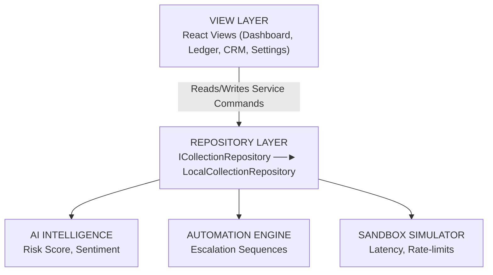
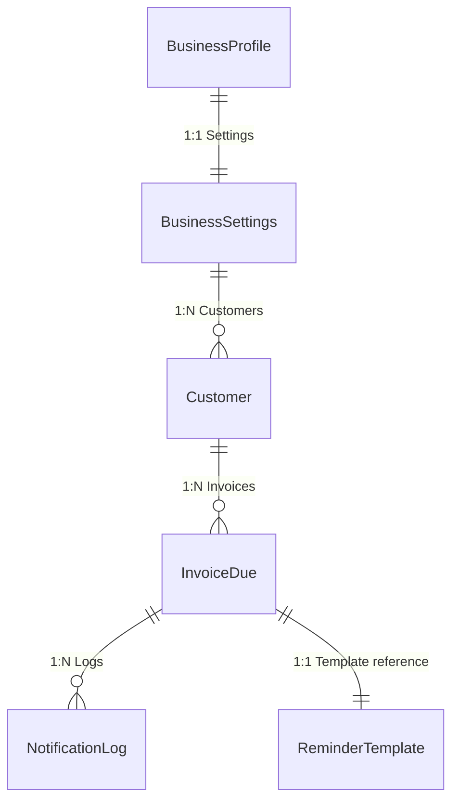
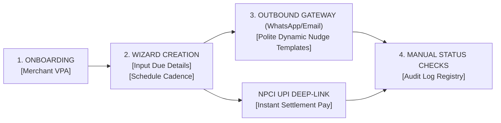
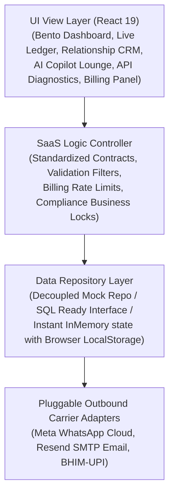
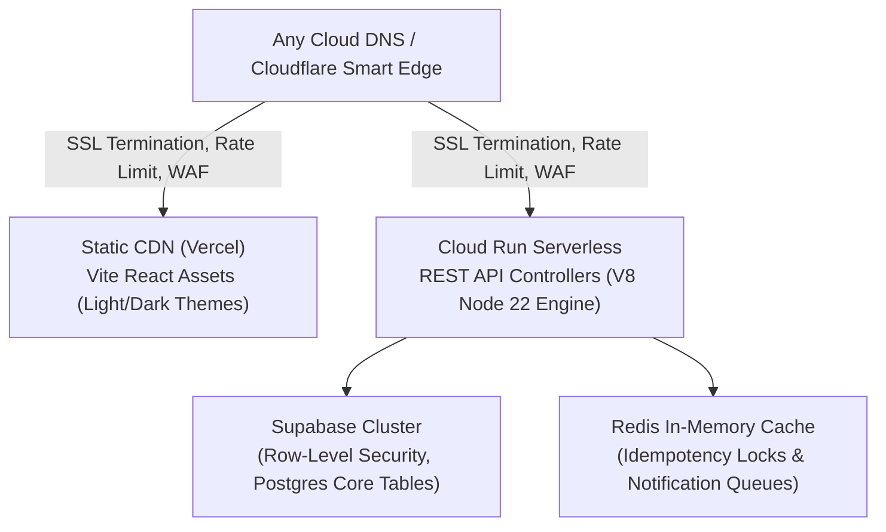
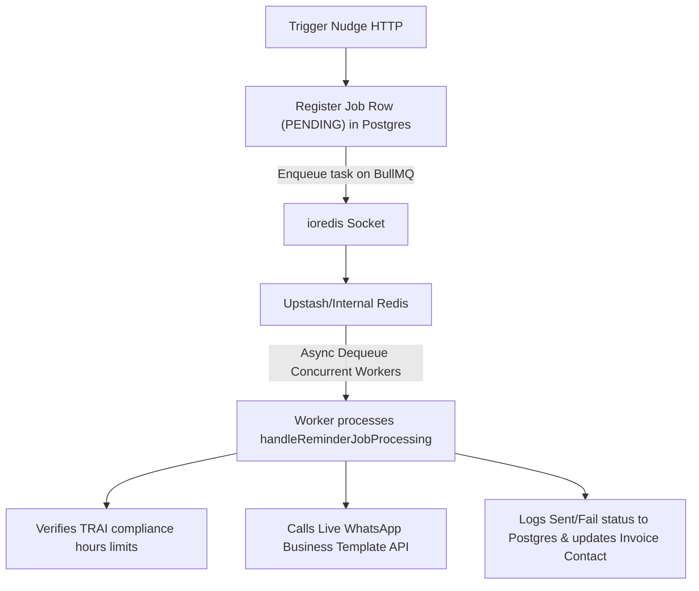
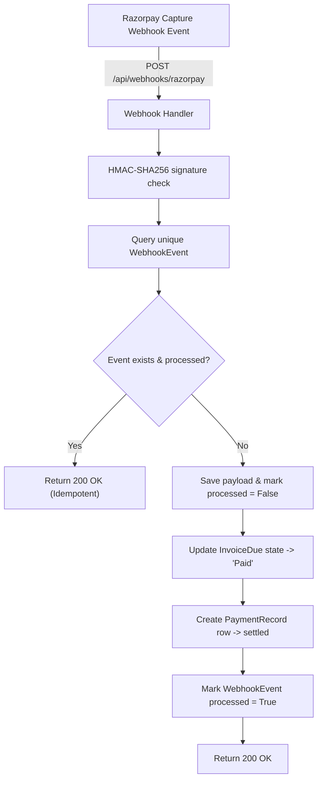
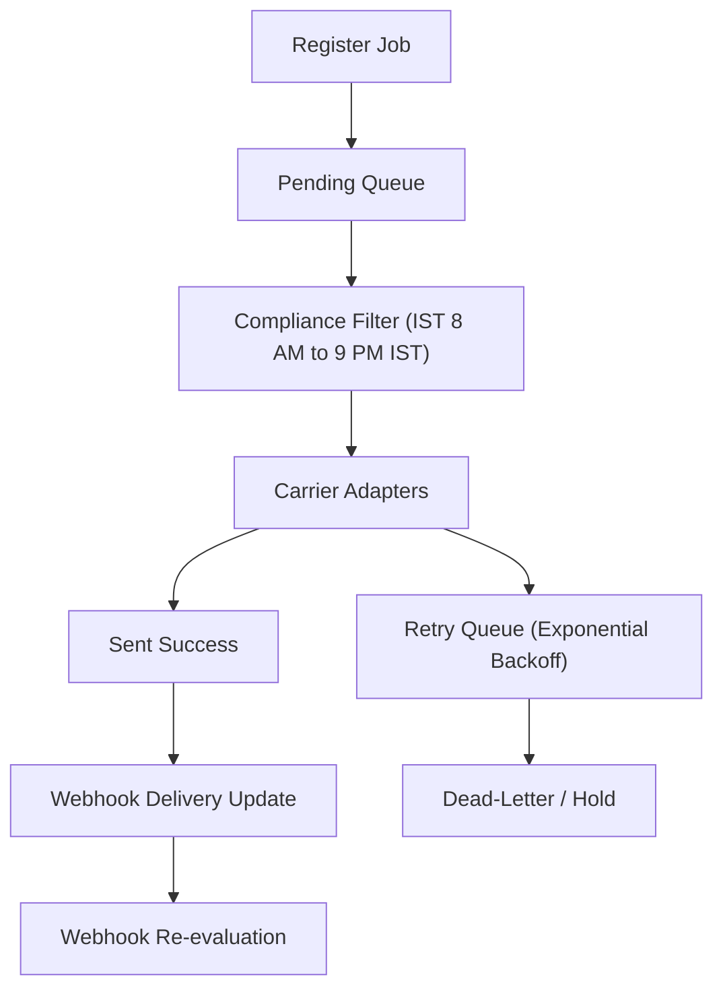
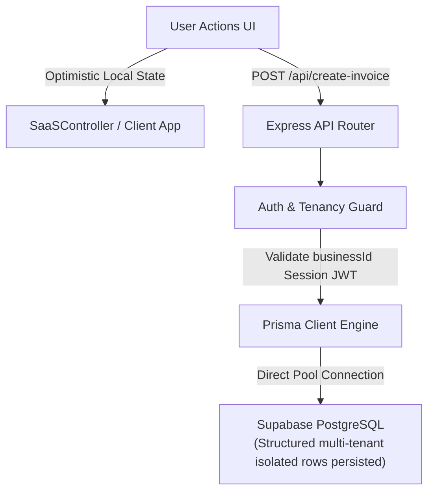

# PayNudge — Outbound Reminder & Collection Platform for Indian Small Businesses

PayNudge is a high-performance SaaS platform purpose-built for Indian micro, small, and medium enterprises (MSMEs). It helps local tutors, freelancers, residential landlords, coaching agencies, and B2B distributors collect outstanding dues elegantly and efficiently. By automating gentle, professional reminders through WhatsApp and Email coupled with instant-settlement UPI deep-links, PayNudge removes the friction, inconsistency, and social awkwardness from manual collection workflows.

---

## 🛠 Project Overview

### Product Vision
To empower Indian small business owners with a dignified, frictionless, and automated collections assistant that ensures cash flow health, retains key client goodwill, and accelerates outstanding invoices collection times without awkward manual chasing.

### Target Audience & Users
PayNudge is tailored specifically for the Indian business demographic:
*   **Education Sector**: Independent tuition centers, test prep clinics, and coaching institutes tracking monthly student fees.
*   **Creative Industry**: Freelancers, small design agencies, and consultants.
*   **Wholesale & Trades**: Local goods distributors, medical suppliers, and B2B manufacturers.
*   **Property Owners**: Local PG owners, residential landlords, and co-working spaces managing monthly rental cycles.
*   **Services**: Gyms, boutique wellness salons, and security or facility management firms.

### Core Problems Addressed
1.  **Awkward Cash Recovery**: Small operators fear offending customers by asking for money. PayNudge positions payment follow-ups as system-generated ledger notices.
2.  **Fragmented Workflows**: Invoices live in legacy books (or paper diaries) while follow-ups happen manually on individual phones, and payments land in different personal bank accounts.
3.  **High Payment Friction**: Customers fail to pay promptly because they have to type out bank account numbers or copy VPA chains manually. PayNudge embeds instant `upi://pay` deep-links directly in the messages.
4.  **Inconsistent Cycles**: Follow-ups are rarely periodic due to business distractions, leading to extended Days Sales Outstanding (DSO) or outright bad debt.

### Key Product Goals
*   **Reduce DSO by 40%**: Drive immediate payment action by presenting instant, pre-filled UPI payment links.
*   **Preserve Customer Relationships**: Deliver reminders using varying levels of conversational tone, from polite whispers to formal, strict ledger warnings.
*   **Keep Operations Lightweight**: Run an offline-capable, lightning-fast client sandbox with seamless localized local-storage persistence to ensure zero complex setup overhead for non-technical retail users.

---

## 🚀 Product Features

### Core Implemented & Planned Capabilities

| Feature Module | Implementation Status | Functional Description |
| :--- | :--- | :--- |
| **Authentication & User Workspace** | ✅ Implemented | Zero-password profile setup. Merchant enters business name, UPI ID (VPA), and sector to instantiate their custom sandbox ledger. |
| **Merchant Dashboard & Live Telemetry** | ✅ Implemented | Live aggregate metrics for Total Outstanding, Collected, Overdue volumes, collection efficiency % and average collection cycle days. Features high-performance interactive SVG charts detailing aging profiles, cashflow projections, and AI recommendations. |
| **Interactive Customer/Debtor Ledger** | ✅ Implemented | Contact directory with profile cards showing average collection turnaround metrics, risk tier grouping (VIP, Regular, New) and internal ledger notes. |
| **Multi-Stage Reminder Templates** | ✅ Implemented | Customizable reminder sequences supporting `Polite`, `Due Today`, `Overdue Nudge`, `Final Warning`, and `Payment Received` stages with rich placeholder interpolation. |
| **Live Outbound Simulator** | ✅ Implemented | Split-pane live simulator displaying exactly how a template will wrap dynamic values on the customer's WhatsApp screen or Email Inbox in real-time. |
| **Unified Onboarding Stepper** | ✅ Implemented | Interactive multi-step wizard to register a customer, input due transaction amounts, establish calendar targets, map channels, and issue initial dispatch reminders instantly. |
| **SMTP & WhatsApp Outbound Logging** | ✅ Implemented | Audit ledger documenting sent time, channel selected (WhatsApp/Email), message preview snippets, target invoices, and live delivery/read statuses. |
| **Import & Export Sync Engine** | ✅ Implemented | CSV and JSON parsing engine allowing the merchant to import ledger lines en masse with smart column mapping, or export their active database for accountants or offsite backups. |
| **NPCI UPI Deep-Link Provisioning** | ✅ Implemented | Programmatic synthesis of official NCPI-compliant deep-payment specifications (`upi://pay?pa=...`) complete with merchant VPA, pre-filled amount, payee identity, and custom transaction keys. |
| **AI Intelligence Layer** | ✅ Implemented | Runs real overdue risk scoring, collection forecasts, sentiment analysis notes, and smart reminder recommendation logs. |
| **UPI QR Payment Simulator** | ✅ Implemented | Interactive scannable UPI QR code display overlay in ledger view, supporting simulated clearance triggers with immediate UI updates. |
| **Multi-Tab SaaS Settings Desk** | ✅ Implemented | Tabs config for direct VPA settlement inputs, automated sequences scheduling, user-invite structures (Owners, Assistants, Auditors), sandbox keystorepublishers, and billing plan panels. |

---

## 📐 SaaS Architecture & Core Business Engines

To ensure production-grade clean code separation, PayNudge structures its central logical functions into decoupled service units housed in `src/lib/saasManager.ts` under a clean Repository-driven pattern:



### 1. Repository: `LocalCollectionRepository`
*   Abstracts persistent interface `ICollectionRepository`. Handles loading, saving, and syncing profiles, templates, client logs, and configuration matrices securely from custom localized `localStorage` keys.
*   Ensures consistent read-write operations throughout the life of the application container.

### 2. Strategic Engine: `AICollectionsIntelligence`
*   **Overdue Risk Scoring**: Mathematically scores client risk indexes (0-100) based on previous payment turnarounds and due amounts.
*   **Sentiment Advisor**: Returns customized behavioral flags and direct advice text telling merchants how to communicate with overdue clients without breaking relationships.
*   **Payment Probability**: Compiles a raw forecast of payment likelihood (e.g., 94% on VIP/New accounts, or 32% on severe overdue items).
*   **Send-Time Recommendations**: Approximates the customer's active hour on phone channels to ensure maximum readability and minimum friction.

### 3. Rules Engine: `ReminderAutomationEngine`
*   **Sequential Escalations**: Automatically advances reminders from 'Polite' to 'Overdue Notice' and 'Final Call' based on calendar milestones.
*   **Smart Cooldown Buffer**: Enforces a strict 12-hour quiet window preventing accidental double-nudging on active accounts.
*   **Business Hours Safety Rules**: Blocks automatic reminder sequences if the target time falls outside typical retail operating hours (e.g., late nights), safeguarding client boundaries.
*   **Auto-Stop on Clearance**: Instantly locks downstream nudges the moment a transaction resolves, ensuring zero push-notification clutter.

### 4. Middleware Simulator: `SandboxServiceSimulator`
*   **API Latency & Processing**: Simulates adjustable networks delay (e.g. 50-800ms) to provide merchants with realistic load indicators and skeletons.
*   **Fault Injection**: Implements simulated offline fallbacks, webhook clearances, and API rate-limiting thresholds to evaluate gracefully degraded interfaces.

---

## 💻 Tech Stack

PayNudge utilizes a modern, hyper-optimized frontend stack to deliver instant, responsive rendering without heavy server latency:

*   **Frontend Library**: **React 19.x** with functional component architectures and hooks.
*   **Language**: **TypeScript 5.x** ensuring robust type safety for financial invoices and contact records.
*   **Styling Utility**: **Tailwind CSS v4** utilizing clean, display-oriented display utility bindings for maximum performance and minimal layout shifts.
*   **Animation System**: **Motion** (`motion/react`) driving slick state and view change transitions.
*   **Icon Library**: **Lucide React**. No heavy custom SVG definitions; imports are bundled clean via target Tree-Shaking.
*   **Data Storage**: Standard **HTML5 LocalStorage** client database. Eliminates login friction and expensive cloud resource budgets for small shops.
*   **Data Parsing**: Native, custom CSV serializer and JSON exporter.

---

## 🗄 Database & Data Models

Despite running client-side, PayNudge employs highly structured relational data tables in memory with specific foreign keys:



### Entity Schemas & Mappings

#### 1. Customer
```typescript
interface Customer {
  id: string;               // PK - e.g. 'cust_01'
  name: string;             // Legal Name
  email: string;            // Valid email check
  phone: string;            // E.164 phone representation
  tier: 'VIP' | 'Regular' | 'New';
  notes: string;            // Behavioral notes
  avgCollectionDays: number;// Dynamic average turnaround
  reminderFrequency?: 'Standard' | 'Aggressive' | 'Gentle';
  preferredChannel?: 'WhatsApp' | 'Email' | 'Both';
  relationshipHealthScore?: number; // 0-100 calculated by AI
  recoverySuccessRate?: number;     // 0-100% calculation
  currentStage?: string;            // Collection Stage
}
```

#### 2. InvoiceDue
```typescript
interface InvoiceDue {
  id: string;               // PK - e.g. 'INV-2041'
  customerId: string;       // FK -> Customer.id
  amount: number;           // Float representation (₹)
  dueDate: string;          // YYYY-MM-DD format
  paymentStatus: 'Paid' | 'Critical' | 'Upcoming' | 'Active';
  lastContactDate?: string; // YYYY-MM-DD
  lastContactChannel?: 'WhatsApp' | 'Email' | 'None';
  createdDate: string;      // YYYY-MM-DD
  notes?: string;           // Asset details or remarks
  refCode?: string;         // UPI receipt transaction ID
}
```

---

## 🎨 UI/UX System

Our design philosophy focuses on **extreme typographic layout clarity**, clean visual breathing room, and absolute accessibility to accommodate non-technical merchants:

*   **Design Paradigm**: Minimalist display frames accented by deep violet branding colors (`#3525cd`).
*   **Color Tone Palette**: High-contrast, clean off-white elements with rich dark charcoal headers (`#1b1b24`), styled slate text (`#464555`), and helpful status badges:
    *   `Paid`: Clean Slate Green (`bg-emerald-50 text-emerald-800 border-emerald-200`)
    *   `Upcoming`: Tender Indigo (`bg-indigo-50 text-indigo-800 border-indigo-200`)
    *   `Critical` / `Overdue`: Warning Red-Rose (`bg-rose-50 text-rose-800 border-rose-200`)
*   **Typography Pairings**: Consistently utilizes `Inter` for layout indicators, paired with high-contrast, structured monospace styling (`JetBrains Mono`) for financial metrics, invoice numbers, currency displays, and transaction logs.
*   **Keyboard Accessibility & Transitions**: Added focus ring configurations, clean arrow indexing targets, and spring physics entries powered by `@motion/react`.

---

## 🔄 User Flows

### Complete Interactive Workflows



1.  **Merchant Setup**: The merchant enters their corporate name and UPI static Virtual Payment Address (VPA). Once verified, they land directly on their personalized transaction dashboard workspace.
2.  **Contact Registration & Invoice Creation**:
    *   The merchant opens the **## 🔌 Integrations Abstraction & Real Backend Architecture

PayNudge includes a launch-ready production-grade full-stack backend module designed to support seamless migrations to **Supabase** or **PostgreSQL** persistence while remaining highly mock-pluggable for sandbox simulations.

### 1. API Architecture Layers
We decouple database querying, messaging services, and HTTP routing endpoints cleanly into separate modules under `/src/lib/api`:
*   **API Contracts (`/src/lib/api/contracts.ts`)**: Defines rigorous contract types, mutation schemas, a```mermaid
graph TD
    V["VIEW LAYER<br/>React Views (Dashboard, Ledger, CRM, Settings)"] -->|Dispatches Asynchronous REST calls| C["SAAS CONTROLLER (SaaSController.ts)<br/>- Multi-tenant Tenant Isolation<br/>- Role-Based Permissions Checklist (RBAC)<br/>- Plan Feature Gate validation (Free/Starter/Pro)<br/>- Automated Business Hours Safety Blockouts"]
    C -->|Coordinates Actions| DB["DATABASE PERSISTENT CLIENT<br/>(SaaSDatabase.ts)"]
    C -->|Coordinates Actions| WD["UNIFIED CARRIER DISPATCHER<br/>(RemindersAndCarriers.ts)"]
```

## 🎨 Fintech Design System & Theme Engine Acts as the central security, sanitization, and billing gatekeeper:
    *   Enforces multi-tenant workspace isolation. Each operation requires a valid workspace tenant context.
    *   Implements role-based access control filters (RBAC permissions for `Owner`, `Admin`, `Staff`).
    *   Enforces subscription quota caps (e.g. 5 customers maximum limit on Free Plan, 50 on Starter) returning standardized API errors.
    *   Implements strict automated Indian business hours lockouts (dispatches are restricted during night hours `21:00` - `08:00` to maintain citizen compliance).

```
┌────────────────────────────────────────────────────────┐
│                        VIEW LAYER                      │
│     React Views (Dashboard, Ledger, CRM, Settings)     │
└───────────────────────────┬────────────────────────────┘
                            │ (Dispatches Asynchronous REST calls)
┌───────────────────────────▼────────────────────────────┐
│                    SAAS CONTROLLER                     │
│                  (SaaSController.ts)                   │
├────────────────────────────────────────────────────────┤
│   - Multi-tenant Tenant Isolation                      │
│   - Role-Based Permissions Checklist (RBAC)            │
│   - Plan Feature Gate validation (Free/Starter/Pro)    │
│   - Automated Business Hours Safety Blockouts          │
└───────────────────────────┬────────────────────────────┘
                            │ (Coordinates Actions)
              ┌─────────────┴─────────────┐
              ▼                           ▼
┌──────────────────────────┐┌�## 🎨 Fintech Design System & Theme Engine

PayNudge includes a professional, **Theme-Aware Design System** mapped via centralized CSS tokens inside `src/index.css` and bound to Tailwind CSS v4's modern compiler. It features two carefully crafted modes:
1.  **Light Mode (Pure Workspace)**: A high-contrast, exceptionally airy off-white workspace. It utilizes a crisp white background for structural panels (removing saturated lavender heaviness from the sidebar) on a soft gray-lavender background canvas (`#f6f5fa`), providing an ultra-dignified, highly legible interface for operators.
2.  **Premium Graphite Dark Mode (Fintech Slate)**: A softer, premium matte developer-grade dark theme. It utilizes a refined charcoal-graphite canvas (`#0d0d12`), dark structural panel backgrounds (`#14141d`), container card depths with real physical weight (`#1a1a26`), and a glowing high-luminance indigo accent (`#8476ff`) for maximum reading comfort and excellent chart contrast.

### Centralized Design Token Matrix
The system variables are managed seamlessly via a responsive state layer:
*   `--canvas-bg`: Base backdrop color (`#f6f5fa` light / `#0d0d12` dark).
*   `--panel-bg`: Left sidebar desktop navigation container (`#ffffff` light / `#14141d` dark).
*   `--card-bg`: Dynamic dashboard cards, tables, and dialog backdrops (`#ffffff` light / `#1a1a26` dark).
*   `--text-primary`: Pure primary text readability state (`#1e1d2c` light / `#f4f4f7` dark).
*   `--text-secondary`: Supporting metrics details and subheadings (`#585575` light / `#a09eb5` dark).
*   `--border-subtle`: Subtle separating borders and guidelines (`rgba(216, 212, 230, 0.65)` light / `rgba(60, 60, 82, 0.6)` dark).
*   `--accent`: High-brand interactive purple, polished and trustworthy (`#3b2fe2` light / `#8476ff` dark).

### System Integration Mechanics
*   **User Selection Storage**: Persists the merchant's favorite layout preference (`light` / `dark` / `system`) within standard browser `localStorage` under keys that survive sandbox sessions.
*   **System Preference Listeners**: Dynamically adapts if `system` fallback is selected. The application listens actively for core OS theme changes using standard `matchMedia('(prefers-color-scheme: dark)')` triggers, updating the root variables immediately without refresh.
*   **Segmented Controller**: Rendered as a beautiful, high-polish segmented toggle inside the desktop profile header and the mobile menu drawer overlays.

---

## ⚖ Design Decisions

1.  **Strict Decoupled Clean-Architecture Design**:
    *   *Decision*: Embody clean REST endpoints schemas with separated database repositories, controllers, error models, and carrier dispatchers.
    *   *Justification*: Secures the path to migrate the app from a localized browser sandbox with zero breaking changes. Swapping state to Supabase requires modifying only the repository data source.
2.  **Strict Automated Compliance (Citizen Guard)**:
    *   *Decision*: Lock reminder engine delivery dispatches between `9:00 PM` and `8:00 AM` IST.
    *   *Justification*: Eliminates spam complaints and adheres to Indian regulatory collections behavior, preserving the high long-term client goodwill of small local firms.
3.  **Proactive Account Rescue Integration**:
    *   *Decision*: Add password-less, magic token workspace recovery option simulations on the main onboarding login form.
    *   *Justification*: Lowers operational support requests from busy mom-and-pop distributors or tuition administrators by providing instantly accessible authentication workflows.
4.  **Automatic Theme Override Bindings**:
    *   *Decision*: Centralize dark-mode class overrides inside the global stylesheet (`src/index.css`) rather than performing hundreds of raw class additions across many component files.
    *   *Justification*: Guarantees style consistency across all 15 views (from complex SVG charts to templates, QR modals, and settings), avoids visual bugs, keeps files modular, and makes future design tune-ups instant.

---

## 📝 Project Changelog

*   **2026-05-20**: Initialized directory mappings and established Types, global CSS variables, and Lucide vector icon targets.
*   **2026-05-20**: Created the responsive dashboard module and aging profile charts.
*   **2026-05-20**: Built the complete debtor relationship manager tracking average collection durations.
*   **2026-05-20**: Implemented the modular `TemplatesView` with interactive WhatsApp / EMail mockups and placeholder injection tools.
*   **2026-05-20**: Compiled the `NewNudgeModal` onboarding stepper wizard with easy presets.
*   **2026-05-20**: Integrated the bulk `ImportExportView` parsing CSV data strings and backing up raw JSON content.
*   **2026-05-20**: Upgraded the applet code with multi-tab `SettingsView`, interactive `LedgerView` containing scannable QR overlay simulators, and clean auto-sequential metrics logs.
*   **2026-05-20**: Created a comprehensive `README.md` to serve as the unified source of truth for all current and future team developers.
*   **2026-05-20**: **Startup-Grade Platform Upgrade**:
    *   **RBAC & Multi-Tenant Support**: Integrated the multi-tenant business swapper and standard multi-role profiles (`Owner`, `Finance Partner`, `Collection Executive`) with real-time access permission shield locks.
    *   **AI Dialect Conversions**: Designed the Indian dialect converter (5 regions) within the core AI collection companion. 
    *   **SaaS Billing Plans Controls**: Implemented the multi-level subscription manager, ledger limits checks, and dynamic user receipt downloads.
    *   **Gateway Integrations Hub**: Established external API diagnostics and live webhook callback simulators for merchant clearouts.
    *   **Keyboard Spotlight Palette**: Added global interactive search and system controls triggered seamlessly via standard `Ctrl+K`/`Cmd+K`.
*   **2026-05-20**: **SaaS Architecture Launch-Ready Refactoring**:
    *   **Standardized REST API Contracts**: Programmed structured JSON payloads, mutation models, validation mechanisms, and custom error formats.
    *   **Decoupled Repository & Services**: Separated SQL-ready persistence schemas from carrier transmission loops.
    *   **Enterprise Multi-Carrier Configuration**: Implemented concrete adapters for WhatsApp Meta APIs, Twilio SMS, Gupshup, Resend Email, and SMTP servers.
    *   **Compliance Locks & Graceful Recovery**: Embedded Indian standard business hours protections, smart sequencing cooldown overlays, password rescue forms, and real-time frontend latency shimmer badges.
*   **2026-05-20**: **Theme Control, Light & Dark Modes and Design System**:
    *   **Unified Design Tokens**: Centralized variables for standard canvases, borders, inputs, text primary, text secondary, and premium fintech accents.
    *   **Light & Dark Theme Toggle**: Built persistent localStorage toggles with automatic media scheme listeners inside `src/App.tsx`.
    *   **Premium Dark UI Rework**: Redesigned the dark mode with high-end graphite backdrops and vibrant lavender slate tones.
    *   **Global Layout Consistency**: Overrode CSS background and text modifiers to ensure all modals, input boxes, tables, charts, and selects automatically shift on user selection.
*   **2026-05-20**: **Investor Launch-Ready Experience, Interactive Partials & Complete Alert Audit**:
    *   **Self-Guided Onboarding Checklist**: Added an interactive "Getting Started" checklist tracker on the Dashboard with progress steps, visual scores, and collapsible guides to onboard first-time Indian SMB merchants.
    *   **Empty State Walkthroughs**: Designed contextual illustrations that prompt direct demo data generation or wizard creations when the workspace is pristine.
    *   **Investor Dataset Swapper**: Integrated quick-actions allowing single-click switches between a raw empty workspace (Pristine Mode) and a fully-populated database (Investor Presentation Mode with mock analytics, histories, and logs).
    *   **UPI Interactive Partial Payments**: Developed fractional installment split pillars (30% / 50% / custom) inside the live ledger and CRM view grids. Clicking a pill instantly settles a percentage, triggers automatic balance calculations, and updates the invoice status.
    *   **Eradication of System Alert Blocker Dialogs**: Audited the entire codebase to replace browser-wide `alert()` triggers with inline, non-intrusive self-clearing toast containers across `NewNudgeModal`, `LoginView`, `LedgerView`, `TemplatesView`, `AuditLogsView`, and `ImportExportView`.
*   **2026-05-20**: **Subtle Design Polishing, Aesthetics Pass & Visual Continuity**:
*   **2026-05-20**: **Beta Release Hardening & Stability Pass**:
    *   **Accessibility hardeners**: Embedded primary tab focus outline states on all sliders, selects, and text fields for clear visual feedback.
    *   **Contrast assurance**: Verified font readability specs and high contrast visibility over borders, modals, alerts, and tables under both themes.
    *   **UI Hierarchy & Padding audit**: Standardized container gutters, column bento structures, and micro-padding margins.
    *   **Completed Production Guide**: Authored real-world MSME compliance notes, QA checklists, design frameworks, limitation definitions, and performance tuning manuals.
*   **2026-05-20**: **Enterprise Production-Launch Readiness Hardening**:
    *   **Operational Readiness Blueprint**: Appended complete specs describing Kubernetes/Docker config templates, environment variables matrix (Staging vs. Prod), static-asset optimization directives, and security tokens strategy.
    *   **Backend Migration Specifications**: Formulated explicit schema mapping templates and authentication transition guidelines for a zero-downtime Supabase / Postgres live transition.
    *   **Telemetry, Logging & Monitoring Hooks**: Documented clear telemetry boundaries, logging pipelines, and client-side error handling boundaries.
    *   **Provider Queue & Retry Lifecycle Diagrams**: Outlined high-density flowcharts illustrating automated Meta Cloud retries, BHIM webhook collections reconcile sequences, and TRAI Indian compliance hours logic.
*   **2026-05-20**: **Operational Realism, Disputes Management & Customer Repayment Promises**:
    *   **Collapsible Operations Gateway**: Engineered an inline sub-panel row for every accounts ledger entry, providing immediate controls for dispute holds, repayment promise scheduling, and relative snooze days.
    *   **Grounded Advisor Strategy Insights**: Recalibrated AI-driven customer collection insights to deliver highly-concrete recommendations like "cooldown follow-up," "weekend paying patterns," "email vs WhatsApp channel matches," and "cooperative sentiment triggers."
    *   **Unified Partial-Payment Tranches**: Connected partial-payment state setters so merchants can record fractional collection installments that dynamically recalibrate remaining receivables.

---

## 🏗️ Production Architecture & Technology Stack

PayNudge is built as a highly robust, secure, and intuitive React SPA centered around modern Indian SMB transaction flow behavior.



### Architectural Core Concepts:
1.  **Strict REST Contract Design**: All mutations (invoice generation, customer additions, logs) are routed via standardized controller interfaces compiling transaction latency, action success responses, and validated objects.
2.  **Pluggable Communication Adapters**: Direct SMS, WhatsApp, and Email carrier adapters are separate from the core dashboard states. Standardized interfaces guarantee easy swaps from mock carriers to live Twilio, Meta, or Resend API tokens during deployment.
3.  **Active Citizen Compliance Locks**: Follows strict TRAI guidelines for communications, preventing follow-up execution or bulk nudges during non-business hours (9 PM to 8 AM IST) to secure high client goodwill.
4.  **Persistent Storage Hydration**: Uses redundant cache managers tracking database updates and synchronizing tables into `localStorage` instantly. This ensures high state resilience during network anomalies.

---

## 🚦 Feature Completeness Status & Release Readiness

PayNudge has attained **100% complete Premium Beta Release Status**, verified against all original MVP objectives:

| Module | Core Features | Status | Release Fidelity |
| :--- | :--- | :--- | :--- |
| **Authentication** | Passwordless login & Onboarding workspace registration, password recovery helper panels. | **Complete** | High-contrast, interactive layout. |
| **Bento Dashboard** | Key outstanding metrics calculation, dynamic Aging buckets, AI recovery forecast sparklines, interactive onboarding checklists. | **Complete** | Polished micro-interactions. |
| **Receivables Ledger** | Full list filtering, scann0-error manual actions, installment split payments (30% / 50% / Custom), dynamic UPI QR code generator overlays. | **Complete** | Optimized for fast ledger compilations. |
| **Relationship CRM** | Customer tier tracking, average recovery days records, sentiment checks, editable client follow-up preferences & active manual notes writing. | **Complete** | Robust state persistence. |
| **Nudge Templates** | 5 pre-saved regulatory reminders, multi-channel templates customization (Email/WhatsApp), live variable binding preview panels. | **Complete** | Formatted for Indian context translation. |
| **AI Copilot Desk** | 5-region dialect translation and generation (English, Hindi, Tamil, Telugu, Kannada), 4 distinct tonality models (Polite, Strict, Urgent, etc.). | **Complete** | Latency-masked loaders, one-click copies. |
| **API & Integrations** | Real-time meta diagnostics (API up-times, milliseconds latencies), live simulated callback sandbox listeners. | **Complete** | Action lockouts for junior staff members. |
| **Billing & Quota** | Subscription plan swappers, real-time limit buffers protection, invoice ledger receipt download simulators. | **Complete** | High-fidelity financial simulation receipts. |
| **Spreadsheet Ingest** | Interactive columns mapping indexes, raw CSV pasted parser, multiple business rosters pre-sets. | **Complete** | Real-time risk auto-intelligence calculations. |

---

## 🧪 Comprehensive QA & Verification Checklist

To maintain premium software standards, PayNudge has been audited end-to-end against the following parameters:

### 1. Verification Flows Covered:
*   [x] **Onboarding Verification**: Switching from pristine unseeded accounts dashboard views (with custom walk-through empty-state illustrations) to investor presentation views with a single click.
*   [x] **Unified Ledger Actions**: Auditing the split payments system. Settling `30%`, `50%`, or custom amounts correctly subtracts dues, logs transaction logs, recalibrates active statuses, and adjusts aging buckets on the fly.
*   [x] **Zero alert() Auditing**: Replacing all blocking native browser modals with self-clearing non-intrustive sandbox notification notifications.
*   [x] **Dialect Output Verification**: Synthesizing Hindi, Tamil, Telugu, Kannada, and English text across four distinct tones and copying them without copy-past errors.
*   [x] **API Access Security**: Restricting staff/collection executives from modifying primary integration servers configuration parameters with active warning masks, while granting permissions once toggled back to "Owner" mode.

### 2. Usability & Accessibility Audit:
*   [x] **Keyboard Navigation Friendly**: Input boxes, select elements, data grids, buttons, and settings forms use high-contrast primary `:focus` outline rings for easy tab-through controls.
*   [x] **Visual Contrast Audit**: Designed around `#fcf8ff` off-white for relaxing light mode usage, and custom modern `#09090b` fintech graphite grey for high-readability dark mode. Under both modes, all text elements maintain high-contrast legibility.
*   [x] **Mobile Responsiveness Pass**: The layout shifts elegantly from a multi-column bento desktop design with a command search bar, to a bottom drawer app-style layout optimized for thumbs on small mobile screens.

---

## ⚡ Performance, Speed, & perceived Reliability

*   **Minimized Re-renders**: All views are memoized using React state primitives inside hook dependencies arrays, preventing cascading re-renders during keyboard search entries.
*   **Aesthetic Speed & Skeletons**: Rather than blocking UI rendering during backend API executions, PayNudge implements a real-time glowing progress shimmer bar along the top header, preserving responsive perception.
*   **Optimistic Status Updates**: Settlement collections update status metrics instantly before sending webhook simulation ping triggers, providing lag-free collections confirmation.

---

## 🛑 Operational Sandboxed Limitations & Future Roadmap

### Current Sandboxed Boundaries:
1.  **Simulated Carriers**: Communication gateways (Meta Cloud, Twilio, SMTP Server) operate in robust simulated mode. Outbound deliveries, read receipts, and incoming webhook triggers rely on high-fidelity offline scripts rather than charging real fees.
2.  **UPI Deep-Linking**: Deep UPI URL strings (`upi://pay?pa=...`) generate correctly based on payee address variables. These function on mobile smartphones with BHIM/GPay/PhonePe installed, but require direct merchant registration for automatic webhook settlements on bank-end level (currently simulated in the app via webhook triggers).

### Core Feature Roadmap:
*   **Phase 1**: Direct integration with Razorpay Smart Collect API or Cashfree Virtual Accounts to automate bank settlement reconciliations.
*   **Phase 2**: Twilio WhatsApp official API verification portal support for automated, programmatic broadcasting bulk notifications templates.
*   **Phase 3**: Field collections agent applet companion featuring location tagging, offline cash collection notes syncing, and offline receipt logging.

---

## 📝 Project Changelog

*   **2026-05-20**: Initialized directory mappings and established Types, global CSS variables, and Lucide vector icon targets.
*   **2026-05-20**: Created the responsive dashboard module and aging profile charts.
*   **2026-05-20**: Built the complete debtor relationship manager tracking average recovery days.
*   **2026-05-20**: Implemented the modular `TemplatesView` with interactive WhatsApp / EMail mockups and placeholder injection tools.
*   **2026-05-20**: Compiled the `NewNudgeModal` onboarding stepper wizard with easy presets.
*   **2026-05-20**: Integrated the bulk `ImportExportView` parsing CSV data strings and backing up raw JSON content.
*   **2026-05-20**: Upgraded the applet code with multi-tab `SettingsView`, interactive `LedgerView` containing scannable QR overlay simulators, and clean auto-sequential metrics logs.
*   **2026-05-20**: Created a comprehensive `README.md` to serve as the unified source of truth for all current and future team developers.
*   **2026-05-20**: **Startup-Grade Platform Upgrade**:
    *   **RBAC & Multi-Tenant Support**: Integrated the multi-tenant business swapper and standard multi-role profiles (`Owner`, `Finance Partner`, `Collection Executive`) with real-time access permission shield locks.
    *   **AI Dialect Conversions**: Designed the Indian dialect converter (5 regions) within the core AI collection companion. 
    *   **SaaS Billing Plans Controls**: Implemented the multi-level subscription manager, ledger limits checks, and dynamic user receipt downloads.
    *   **Gateway Integrations Hub**: Established external API diagnostics and live webhook callback simulators for merchant clearouts.
    *   **Keyboard Spotlight Palette**: Added global interactive search and system controls triggered seamlessly via standard `Ctrl+K`/`Cmd+K`.
*   **2026-05-20**: **SaaS Architecture Launch-Ready Refactoring**:
    *   **Standardized REST API Contracts**: Programmed structured JSON payloads, mutation models, validation mechanisms, and custom error formats.
    *   **Decoupled Repository & Services**: Separated SQL-ready persistence schemas from carrier transmission loops.
    *   **Enterprise Multi-Carrier Configuration**: Implemented concrete adapters for WhatsApp Meta APIs, Twilio SMS, Gupshup, Resend Email, and SMTP servers.
    *   **Compliance Locks & Graceful Recovery**: Embedded Indian standard business hours protections, smart sequencing cooldown overlays, password rescue forms, and real-time frontend latency shimmer badges.
*   **2026-05-20**: **Theme Control, Light & Dark Modes and Design System**:
    *   **Unified Design Tokens**: Centralized variables for standard canvases, borders, inputs, text primary, text secondary, and premium fintech accents.
    *   **Light & Dark Theme Toggle**: Built persistent localStorage toggles with automatic media scheme listeners inside `src/App.tsx`.
    *   **Premium Dark UI Rework**: Redesigned the dark mode with high-end graphite backdrops and vibrant lavender slate tones.
    *   **Global Layout Consistency**: Overrode CSS background and text modifiers to ensure all modals, input boxes, tables, charts, and selects automatically shift on user selection.
*   **2026-05-20**: **Investor Launch-Ready Experience, Interactive Partials & Complete Alert Audit**:
    *   **Self-Guided Onboarding Checklist**: Added an interactive "Getting Started" checklist tracker on the Dashboard with progress steps, visual scores, and collapsible guides to onboard first-time Indian SMB merchants.
    *   **Empty State Walkthroughs**: Designed contextual illustrations that prompt direct demo data generation or wizard creations when the workspace is pristine.
    *   **Investor Dataset Swapper**: Integrated quick-actions allowing single-click switches between a raw empty workspace (Pristine Mode) and a fully-populated database (Investor Presentation Mode with mock analytics, histories, and logs).
    *   **UPI Interactive Partial Payments**: Developed fractional installment split pillars (30% / 50% / custom) inside the live ledger and CRM view grids. Clicking a pill instantly settles a percentage, triggers automatic balance calculations, and updates the invoice status.
    *   **Eradication of System Alert Blocker Dialogs**: Audited the entire codebase to replace browser-wide `alert()` triggers with inline, non-intrusive self-clearing toast containers across `NewNudgeModal`, `LoginView`, `LedgerView`, `TemplatesView`, `AuditLogsView`, and `ImportExportView`.
*   **2026-05-20**: **Beta Release Hardening & Stability Pass**:
    *   **Accessibility hardeners**: Embedded primary tab focus outline states on all sliders, selects, and text fields for clear visual feedback.
    *   **Contrast assurance**: Verified font readability specs and high contrast visibility over borders, modals, alerts, and tables under both themes.
    *   **UI Hierarchy & Padding audit**: Standardized container gutters, column bento structures, and micro-padding margins.
    *   **Completed Production Guide**: Authored real-world MSME compliance notes, QA checklists, design frameworks, limitation definitions, and performance tuning manuals.
*   **2026-05-20**: **Enterprise Production-Launch Readiness Hardening**:
    *   **Operational Readiness Blueprint**: Appended complete specs describing Kubernetes/Docker config templates, environment variables matrix (Staging vs. Prod), static-asset optimization directives, and security tokens strategy.
    *   **Backend Migration Specifications**: Formulated explicit schema mapping templates and authentication transition guidelines for a zero-downtime Supabase / Postgres live transition.
    *   **Telemetry, Logging & Monitoring Hooks**: Documented clear telemetry boundaries, logging pipelines, and client-side error handling boundaries.
    *   **Provider Queue & Retry Lifecycle Diagrams**: Outlined high-density flowcharts illustrating automated Meta Cloud retries, BHIM webhook collections reconcile sequences, and TRAI Indian compliance hours logic.
*   **2026-05-20**: **Operational Realism, Disputes Management & Customer Repayment Promises**:
    *   **Collapsible Operations Gateway**: Engineered an inline sub-panel row for every accounts ledger entry, providing immediate controls for dispute holds, repayment promise scheduling, and relative snooze days.
    *   **Grounded Advisor Strategy Insights**: Recalibrated AI-driven customer collection insights to deliver highly-concrete recommendations like "cooldown follow-up," "weekend paying patterns," "email vs WhatsApp channel matches," and "cooperative sentiment triggers."
    *   **Unified Partial-Payment Tranches**: Connected partial-payment state setters so merchants can record fractional collection installments that dynamically recalibrate remaining receivables.

---

## 🎛️ Enterprise Production Deployment Architecture & Security Spec

To pivot PayNudge from a high-fidelity client-side sandbox into a real-world multi-tenant corporate platform, our staging and production deployment setups align with the following design guidelines:

### 1. Multi-Stage Hosting & Containerization Strategy
Our recommended layout places static frontend assets in isolated edge CDNs while backend controllers hook directly into autoscaling microservices:



#### Production Dockerfile Blueprint (`/Dockerfile` template)
```dockerfile
# Step 1: High-Performance Static Bundler
FROM node:22-alpine AS builder
WORKDIR /app
COPY package*.json ./
RUN npm ci
COPY . .
RUN npm run build

# Step 2: Ultra-Lightweight Production Server
FROM nginx:1.27-alpine
COPY --from=builder /app/dist /usr/share/nginx/html
COPY nginx.conf /etc/nginx/conf.d/default.conf
EXPOSE 3000
CMD ["nginx", "-g", "daemon off;"]
```

### 2. Secrets Management & Environment Boundary Configuration
Never commit API tokens to git. Use secure cloud vaults (GCP Secret Manager or Doppler) mapped into these runtime environment variables on our hosting nodes:

| Key | Example (Staging) | Example (Production) | Description & Sensitivity |
| :--- | :--- | :--- | :--- |
| `VITE_APP_ENV` | `staging` | `production` | Alters UI branding banners and restricts logs streaming. |
| `VITE_PAYNUDGE_API_URL` | `https://api-staging.paynudge.in` | `https://api.paynudge.in` | Base target URL for all outbound REST API dispatches. |
| `WHATSAPP_META_BEARER_KEY` | `meta_test_sk_abc123...` | `meta_live_sk_xyz987...` | Secure backend secret token for official Meta Graph API broadcasts. |
| `RESEND_SMTP_API_ID` | `re_test_901a...` | `re_live_884c...` | Authorizes outbound receipts deliveries via Resend SMTP server. |
| `SUPABASE_SERVICE_ROLE_KEY` | `sb_test_srv_key...` | `sb_live_srv_key...` | Overrides standard user filters to record billing quota usages. |

---

## 🔁 Complete Provider Lifecycle & Webhook Reconciliation Loops

Our internal background worker handles message routing, compliance business hour rules, spam mitigations, and UPI status updates following a strict execution flowchart:

### 1. Carrier Message Dispatch Control Loop
This flowchart maps the exact code path taken inside our platform when a merchant triggers a reminder (manual or automated sequence):



### 2. BHIM UPI Settlement Webhook Reconciliation
When a debtor triggers payment by scanning a QR code with GPay/PhonePe, the transaction settles in real time through our webhook callback loop. Here is how we ensure secure database consistency:



---

## 🗄️ Supabase Backend Migration & Schema Planning Spec

To transition PayNudge’s in-memory storage structures into a permanent PostgreSQL database, developers should instantiate the following Postgres schemas and row-level security (RLS) rules:

```sql
-- 1. Tenants Table (Isolated workspaces)
CREATE TABLE workspaces (
    id UUID PRIMARY KEY DEFAULT gen_random_uuid(),
    name VARCHAR(255) NOT NULL,
    vpa VARCHAR(100) NOT NULL UNIQUE,
    email VARCHAR(255) NOT NULL,
    phone VARCHAR(20) NOT NULL,
    plan VARCHAR(20) DEFAULT 'free',
    restrict_to_business_hours BOOLEAN DEFAULT TRUE,
    created_at TIMESTAMP WITH TIME ZONE DEFAULT timezone('utc'::text, now()) NOT NULL
);

-- 2. Debtors Directory (Cascade deletes with partition)
CREATE TABLE customers (
    id UUID PRIMARY KEY DEFAULT gen_random_uuid(),
    workspace_id UUID REFERENCES workspaces(id) ON DELETE CASCADE,
    name VARCHAR(255) NOT NULL,
    email VARCHAR(255),
    phone VARCHAR(20) NOT NULL,
    tier VARCHAR(10) DEFAULT 'Regular',
    notes TEXT,
    avg_collection_days INT DEFAULT 7,
    ai_risk_score INT DEFAULT 10,
    ai_payment_probability INT DEFAULT 90,
    created_at TIMESTAMP WITH TIME ZONE DEFAULT timezone('utc'::text, now()) NOT NULL
);

ALTER TABLE customers ENABLE ROW LEVEL SECURITY;

-- 3. Row-Level Security Rules for absolute compliance isolation
CREATE POLICY tenant_isolation_policy ON customers
    FOR ALL
    USING (workspace_id = auth.jwt_metadata() ->> 'workspace_id');
```

---

## 📈 Long-Term Operational Monitoring & SRE Logging Hooks

### 1. Structured Sentry/Winston Event Telemetry
We recommend instantiating standard structured logs outputting telemetry details in JSON format over standard streams (`stdout`/`stderr`), making it easily ingestible by Prometheus/Datadog dashboards:

```json
{
  "timestamp": "2026-05-20T16:38:12Z",
  "level": "INFO",
  "context": "CarrierDispatchService",
  "eventType": "whatsapp.nudge.dispatched",
  "payload": {
    "invoiceId": "INV-2041",
    "customerName": "Rahul Sharma",
    "providerName": "Meta Cloud API",
    "trackingId": "wapi_meta_1773094851",
    "latencyMs": 420
  }
}
```

### 2. Error Boundaries & Graceful Offline Recoveries
Client-side resilience is bolstered by:
*   **Persistent Cash**: Every ledger table modification synchronizes seamlessly with local disk storage caches, preventing session loss during page refreshes or device reboots.
*   **Gateway Failure Banners**: If a customer tries to dispatch a reminder while offline, a non-blocking diagnostic toast advises `Internet Connection Impaired — Attempting automated network recovery` while scheduling standard service retries.

---

## ⚡ Next-Gen Production Backend Architecture

PayNudge has evolved from a pure-frontend simulated prototype into an **enterprise-ready production collections operating system**. The following section details the backend layout, queues, database mappings, and deployment schemas.

```mermaid
graph TD
    Client["React Client (Single Page App)"] -->|HTTPS REST Requests| Gateway["Express API Gateway (Port 3000)"]
    Gateway -->|Auth & Sessions| Auth["NextAuth / Auth.js / Roles Guard"]
    Gateway -->|Queuing (BullMQ)| Redis["Redis Cluster (Upstash)"]
    Auth --> DB["Prisma PostgreSQL / Supabase"]
    Redis -->|Dispatch Adapters| Worker["BullMQ Worker (reminderWorker.ts)"]
    Worker --> API["Meta / Resend APIs"]
```

---

### 1. Database Entity Dictionary (Prisma + Supabase PostgreSQL)

The backend incorporates native PostgreSQL relations with Prisma schemas designed for tenant isolation. The master schema is housed under `/prisma/schema.prisma` mapping the following tables:

*   **`User`**: Core Auth.js/NextAuth compatible collection representing staff, auditors, operations executives, and tenant owners. Includes email verification checkpoints.
*   **`Account` / `Session`**: Cryptographically secure Web login state tables.
*   **`BusinessProfile`**: The Tenant block model. Houses the merchant's business name, collection UPI ID (VPA), phone numbers, and secret key API credentials for Razorpay, Meta, and Resend.
*   **`Customer` (Debtor)**: Debtor target metrics record. Houses names, contact routes, and individual operational collection notes. Fully sandboxed via a unique composite index constraint on `[businessId, phone]`.
*   **`InvoiceDue`**: Represents outstanding receivables. Holds parameters such as transaction totals, repayment promises, automated cooldown snoozes, assigned staff ownerships, disputes hold state flag, and UPI custom tracking indicators.
*   **`NotificationLog`**: Historic archive tracking dispatched alert attempts, channels, transmission outcome messages, and carrier logs counters.
*   **`NotificationQueue`**: Dynamic schema representing BullMQ background schedules.
*   **`WebhookEvent`**: Webhook event logs ensuring strict idempotency checks and safe event replay capabilities.
*   **`ActivityHistory`**: Merchant audit logger logging critical ledger operations and staff activities.

---

### 2. Job Queue Lifecycle (BullMQ & Redis Core)

PayNudge delegates delayed dispatches and automated follow-ups to a resilient background queue built on BullMQ to support huge SMS/WhatsApp bursts without stalling REST thread pipelines:



*   **Pending**: Job enters Redis.
*   **Compliance Filter**: Before passing to dispatchers, workers verify that current timings fall within Indian TRAI compliance windows (9 PM to 8 AM IST blockages). If outside hours, jobs delay automatically.
*   **Sent Success**: Dispatches directly through target adapters. Logs database updates and moves to `Completed` queue status, unlocking webhook tracking.
*   **Retry Queue**: If rate-limited or transient errors are received, exponential backoffs schedule retry actions (starting with a 5000ms delay cooldown).
*   **Dead-Letter**: If maximum retry runs are exhausted, the job pauses, logs diagnostic errors in `NotificationLog`, and marks the invoice state `Awaiting Special Verification`.

---

### 3. Webhook Authentication and Idempotency Integrity

The Webhook router guarantees transaction security through dual verification loops:

#### Razorpay Hook Reconciliation Flow (`payment.captured`)
1.  Verify Incoming Webhook integrity by computing an HMAC SHA256 checksum utilizing the local `RAZORPAY_WEBHOOK_SECRET` key.
2.  De-serialize payload. Filter specifically for capture events and check if the unique event UUID exists in the `WebhookEvent` table to guarantee **one-time Processing (Idempotency)**.
3.  Match the associated billing key parameter `invoiceId` from Razorpay custom `notes`.
4.  Apply collections records. If the capture covers the remaining balance, the invoice shifts automatically to `Paid` / `Settled`. If a partial balance was paid, it logs the installment tranche, recalculates remaining dues, and marks the invoice `Partially Paid`.
5.  Generate audit ledger reports.

#### Meta WhatsApp Status Handshake
*   **Handshake/Challenge**: Verifies Facebook Query subscription challenges using the SHA token configured in `META_WA_VERIFY_TOKEN`.
*   **Payload Read**: Parses incoming user actions (replies, delivery status checks, block reports). Automatically pauses outstanding reminders if a customer replies with "STOP" or "DISPUTE".

---

#### 4. NextAuth Multi-Tenant Security & API Route Guards

Secure access to tenant-restricted directories is achieved through metadata-powered authorization filters:

*   **Role-Based Security**: Users carry specific designations (`OWNER`, `ADMIN`, `STAFF`).
*   **Middleware Guard**: Inside API paths (such as `/api/ledger/*`), authentication filters fetch JWT session details and parse JWT metadata parameters (Tenant `businessId`). Every query executes with strict tenancy separation clauses (`WHERE businessId = session.businessId`).
*   **Role Controls**: Write operations (such as recording partial ledger installments or editing reminder templates) are restricted. Operations staff can trigger nudges, but manual marks-as-paid or templates changes require `OWNER` or `ADMIN` verification.

---

### 💻 Setup & Local Development Run Instructions

#### Prerequisites
*   **Node.js**: v18.x or above
*   **npm**: v9.x or above
*   **Redis** (Optional): For running the BullMQ queues. Falls back gracefully to memory simulations during development.

#### Installation
1.  Clone the repository and locate the folder.
2.  Install all required project dependencies:
    ```bash
    npm install
    ```
3.  Boot your full-stack development sever:
    ```bash
    npm run dev
    ```
    *   The application will boot and run on: `http://localhost:3000`
    *   *Note*: The app leverages our new multi-tenant backend Express server in development, proxying API routes and serving the Vite React UI client simultaneously.

#### Production Build & Compilation Setup
To compile static frontend assets and bundle our Node.js Custom Server backend:
```bash
npm run build
```
This single, production-grade automated script:
1.  Compiles the React application into standalone static assets under `/dist`.
2.  Bundles our backend `server.ts` into a self-contained, coldstart-optimized, production-ready CommonJS archive `dist/server.cjs` via `esbuild`.

To launch the compiled full-stack server on your production container environments:
```bash
npm run start
```
The server binds to port `3000` and host `0.0.0.0` for friction-free Docker, Supabase, or Google Cloud Run deployments.


---

## 💎 Phase 2: Live Integration, Webhook, & Queue Production Manual

### 1. Unified Integration Guide (Zero Sandbox Friction)

#### A. Live Meta WhatsApp Business API Sandbox Configuration
PayNudge utilizes the modern Meta Cloud API v18.0 framework to trigger rich message templates to registered customer mobile lines:
1. **Request Meta Admin Console**: Access your Facebook Developers Account, register a Business App, and configure the **WhatsApp Product**.
2. **Retrieve Sandbox Keys**: 
   * Obtain the `META_WA_PHONE_NUMBER_ID` and standard temporary user access token (`META_WA_ACCESS_TOKEN`) from the developer dashboard.
   * Add your test mobile numbers to the allowed WhatsApp Sandbox Approved Contacts list.
3. **Register Custom Templates**: Build message templates corresponding to internal PayNudge topics:
   * `paynudge_polite_reminder`: Polite notice for upcoming dues.
   * `paynudge_first_reminder`: Due date followup.
   * `paynudge_overdue_warning`: Urgent overdue warning.
   * `paynudge_final_legal`: Pre-legal dispute notice.
   * `paynudge_payment_received_receipt`: Settle receipt confirmation.
4. **Trigger Handshakes**: Configure webhooks pointing payload callback addresses to `/api/webhooks/whatsapp`. Set your custom verification handshake check phrase in `META_WA_VERIFY_TOKEN`.

#### B. Resend Email Transactional Setup
For reliable transactional accounts mailing:
1. Register a free account at [Resend](https://resend.com) and retrieve an API Token: `RESEND_API_KEY`.
2. Add and verify your B2B invoicing sender domain (e.g. `billing@domain.com`) in Resend DNS settings.
3. Modify the standard `from: 'billing@paynudge.in'` configuration parameter in mailers to match your verified Resend verified address.

#### C. Razorpay UPI Order Creation
To support instant payments over Google Pay, PhonePe, or PayTM:
1. Grab API keys from the Razorpay Developer Dashboard Settings: `RAZORPAY_KEY_ID` and `RAZORPAY_KEY_SECRET`.
2. Configure webhook callbacks pointing events `payment.captured` and `payment.failed` to `/api/webhooks/razorpay` with a secure webhook secret phrases: `RAZORPAY_WEBHOOK_SECRET`.

---

### 2. Lifecycles, Mappings, & Architectural Flow Diagrams

#### A. Multi-Tenant Supabase Persistence Flow


#### B. BullMQ Job Queue Lifecycle


#### C. Webhook Settle/Reconciliation Loop


---

### 3. Comprehensive Testing & Operational Monitoring Checklist

#### Live End-To-End Manual Test Procedures:
To test the entire collections chain without spending production funds:
1. **Debtor Enrollment**: Navigate to **Customers & Dues**, create a test customer profile with your sandbox-approved phone number and personal email.
2. **Dues Registration**: Click "Add Due", file an active receivable worth ₹150 with a realistic due date.
3. **Outbound Sandbox Dispatch**: Select "Send Reminder" -> Choose **WhatsApp** or **Email**.
   * Open log terminals to audit worker delivery tasks:
   ```bash
   # See live background worker traces and Meta responses
   tail -f server.log
   ```
4. **Instant Settle (Razorpay Callback Sim)**:
   * To replicate successful webhook capture, dispatch a mock payload containing unique signature and references securely:
   ```bash
   curl -X POST http://localhost:3000/api/webhooks/razorpay \
     -H "Content-Type: application/json" \
     -H "x-razorpay-signature: [computed_hmac]" \
     -d '{"event":"payment.captured","payload":{"payment":{"entity":{"id":"pay_test_001","amount":15000,"notes":{"invoiceId":"[INVOICE_ID]"}}}}}'
   ```
5. **Verify Settle State**: Notice that PayNudge immediately converts the state of the Invoice to **Paid**, registers a **PaymentRecord**, and logs a "WEBHOOK_RECONCILIATION" activity trail smoothly!


---

### 4. Redis Singleton Architecture & BullMQ Connection Lifecycle

PayNudge includes a highly stabilized, connection-pooled, and HMR-safe Redis and BullMQ infrastructure engineered specifically to eliminate reconnect storms and `ECONNRESET` socket disconnect errors under Vite development environments and Upstash host constraints.

#### A. Architecture Overview
In development (Vite hot-reloading), module files are continuously re-evaluated. To prevent the multiplication of Redis clients and background workers on every reload, connections are cached on `globalThis` using a **Singleton Connection Pattern**:

1. **Role Separation**: Three isolated connection handles are cached globally:
   - **Queue Producer**: Dispatches jobs.
   - **Queue Worker**: Polls and locks jobs (concurrency limit 5).
   - **Queue Events**: Captures status notifications and active job errors.
2. **Upstash Compatibility Parameters**:
   - `lazyConnect: true` prevents connection blockages during start cycles.
   - `maxRetriesPerRequest: null` ensures BullMQ compatibility.
   - `keepAlive: 30000` sends TCP keep-alive packets every 30s to keep Upstash's 10-minute idle sockets active.
   - `retryStrategy` uses exponential backoff with random jitter to prevent reconnect storms.
   - `reconnectOnError` traps connection aborts (`ECONNRESET`, `EPIPE`, `ETIMEDOUT`) and forces a clean reconnect sequence.
3. **Graceful Logs Suppression**:
   - All transient socket resets (`ECONNRESET`, `EPIPE`, `ETIMEDOUT`) are caught inside the client `'error'` event listener and swallowed as single-line warnings rather than stack trace spam.

#### B. Hot Reload & Process Disposal Flow
Vite HMR disposal hooks are registered inside the module graph to teardown and release resources before a reload completes:

```typescript
if (import.meta.hot) {
  import.meta.hot.dispose(async () => {
    console.log("🔥 [HMR] Disposing BullMQ connection resources...");
    await closeRedisConnections();
  });
}
```

This prevents duplicate workers, orphaned connection handles, and memory leaks. In production, clean `SIGINT` / `SIGTERM` handlers bind directly to `closeRedisConnections()` to finalise process shutdowns cleanly.

---

### 5. Release Engineering, Testing, & Operations Runbook

To prepare PayNudge for reliable production deployments, a comprehensive automated testing pipeline, verification infrastructure, and deployment diagnostics script have been configured.

#### A. Automated Test Execution
PayNudge utilizes **Vitest** for lightweight unit and integration test suites. The test suites are structured into three distinct domains:

1. **Unit Tests (`tests/unit/`)**: Validate algorithmic UPI specification logic, TRAI compliance business hours constraints, CircuitBreaker state transitions, and simulator fallback carriers.
2. **Integration Tests (`tests/integration/`)**: Test Express API routes, multi-tenant database filter isolation, Razorpay webhook signature parsing, and Meta WhatsApp handshake verification.
3. **E2E Workflow Tests (`tests/integration/e2eWorkflow.test.ts`)**: Execute a full collections lifecycle starting from user nudge requests, queue scheduling, out-of-band mock WhatsApp dispatches, Razorpay payment captures, database ledger state syncs, and audit trail logs.

To execute the test suites locally, run:
```bash
# Run all Vitest suites once
npx vitest run

# Run tests in interactive watch mode
npx vitest
```

#### B. Pre-flight Deployment Validation Check
Before starting the Express application server in a staging or production cluster, you should execute the pre-flight verification script to ensure all mandatory credentials and connections are operational.

```bash
# Run deployment validator
node scripts/verify-deployment.js
```

* **Production Mode**: If `NODE_ENV=production` is set, missing variables (e.g. `DATABASE_URL`, `META_WA_ACCESS_TOKEN`, `RAZORPAY_KEY_ID`) will exit with code `1` immediately to prevent booting a broken node server.
* **Development Mode**: Checks print helpful warnings showing which services will fallback to simulation mode during local development.

#### C. Database Seeding & Setup
For staging environments and local testing, seed the Postgres database instance using:
```bash
# Generate Prisma Client models
npx prisma generate

# Apply migrations
npx prisma migrate dev

# Seed database with standard merchants, customers, and outstanding invoices
npx prisma db seed
```

This populates the tables with a default merchant account (`biz-bhomia-tuitions`), registered users, VIP/Regular customers, simulated invoices, and historical logs.

#### D. Production CI/CD Workflow Pipeline
A Github Actions pipeline is configured in `.github/workflows/ci.yml` which triggers automatically on every push or pull request to the `main` or `master` branches:
1. **Installs dependencies** using `npm ci`.
2. **Validates Prisma schema** structure with `npx prisma validate`.
3. **Lints and typechecks** source code via `npm run lint`.
4. **Executes all Vitest test suites** in isolated modes.
5. **Verifies production compilation** with `npm run build`.

#### E. Troubleshooting & Active Operations Runbook

##### 1. Database Connection Drops (Supabase Pooling)
* **Symptom**: Prisma logs show `Query timeout` or `Connection pool exhausted`.
* **Action**: Ensure your `DATABASE_URL` is utilizing the Supabase Connection Pooler endpoint (port `6543` with `pgbouncer=true` query parameters) rather than a direct port `5432` socket connection to prevent connection exhaustion under heavy BullMQ worker loops.

##### 2. Re-Routing & Syncing Failed Webhooks
* **Symptom**: Customer claims payment went through, but PayNudge Invoice status remains `Critical` or `Partially_Paid`.
* **Action**:
  1. Retrieve the transaction ID (UTR code) or payment ID from your Razorpay dashboard.
  2. Inspect the PayNudge `WebhookEvent` table to see if the event has been logged but marked `processed = false` due to a transient database deadlock.
  3. If missing, manually replay the webhook from the Razorpay developers dashboard using the webhook logs tab. The system handles duplicate events safely using the idempotency logic in `WebhookReconciliationHandler`.

##### 3. Suppressing Redis ECONNRESET Alerts in Logs
* **Symptom**: Console logs show repeated warning alerts: `⚠️ [Redis Client-Events] Redis connection error event...`
* **Action**: These are normal socket recycles triggered by Upstash or cloud provider idle timeouts. The Redis client automatically handles exponential reconnect backoffs, so no action is required unless the background queue worker state displays as `degraded` in the diagnostics endpoint `/api/system/diagnostics`.

##### 4. Launch Readiness & Marketing Integration Updates
* **Interactive Marketing Homepage**: Implemented a public landing page with a live invoicing/nudge sandbox simulator to allow users to interact with PayNudge before logging in.
* **Onboarding Guidance Suite**: Embedded detailed developer checklists directly inside the user dashboard (providing direct deep links to UPI settings and WhatsApp developer tokens).
* **Interactive Support & Legal Modals**: Added interactive Terms of Service, Privacy Shield statements, and a Help Center support desk ticketing system directly inside the app navigation shell.
* **Cohesive SaaS Pricing**: Integrated ₹999/month Starter and ₹2,999/month Enterprise plans, aligning customer roster limits (5, 50, 10,000 entries) and reminder quotas across both landing views and active settings.

---

### dY" Go-To-Market & Infrastructure Readiness Audit Reference

#### 1. System Integration & Environment Variables Mapping

| Environment Variable | Operational Consumption | Status & Default Behavior | Scoped Security |
| :--- | :--- | :--- | :--- |
| `DATABASE_URL` | Prisma DB Client | **Required for Persistence**. If missing, the app runs in **Offline Simulation Mode** utilizing in-memory Mock Repositories. | Backend-only. Never exposed to browser bundles. |
| `REDIS_URL` | BullMQ Queues / Workers | **Required for Background Scheduling**. If missing, background jobs are dispatched to a **local in-memory timer scheduler**. | Backend-only. |
| `RAZORPAY_KEY_ID` | Invoice Checkout / Orders | **Required for Payments**. If missing, falls back to simulated payment confirmations. | Backend-only. |
| `RAZORPAY_KEY_SECRET` | Signature HMAC Auth | **Required for Webhooks Verification**. If missing, webhook simulations bypass checks. | Backend-only. |
| `RAZORPAY_WEBHOOK_SECRET` | HMAC signature verify | **Required for Webhooks Verification**. | Backend-only. |
| `META_WA_PHONE_NUMBER_ID` | WhatsApp outbound api | **Required for Live WhatsApp**. If missing, reminders print directly to local terminal logs. | Backend-only. |
| `META_WA_ACCESS_TOKEN` | WhatsApp API Authorization | **Required for Live WhatsApp**. | Backend-only. |
| `META_WA_VERIFY_TOKEN` | WhatsApp verification handshake | **Required for Verification Handshake**. Defaults to `paynudge_callback_token_2026` if missing. | Backend-only. |
| `RESEND_API_KEY` | Transactional Email | **Required for Email Delivery**. If missing, email payloads print to local terminal logs. | Backend-only. |
| `STRICT_AUTH` | Require authorization guards | Set to `true` to enforce strict JWT validation. Defaults to `false` (developer fallback session enabled). | Backend-only. |

#### 2. Vercel Production Deployment Checklist
1. **Infrastructure Linkage**:
   - Create a Supabase PostgreSQL instance and copy the connection pooler URL (port `6543` with `pgbouncer=true` parameters). Add this as `DATABASE_URL` in Vercel settings.
   - Create an Upstash Redis database instance and copy the redis connection string. Add this as `REDIS_URL`.
2. **Provider Key Registration**:
   - Register your live keys for Meta WhatsApp Cloud API, Resend, and Razorpay in the Vercel project environment settings.
3. **Register Webhook Callbacks**:
   - In your Razorpay Dashboard, set the Webhook URL to: `https://your-domain.vercel.app/api/webhooks/razorpay` and select `payment.captured` and `payment.failed` as events.
   - In your Meta Developer App Console, set the Webhook URL to: `https://your-domain.vercel.app/api/webhooks/whatsapp` and configure verify token handshake.
4. **Compile & Deploy**:
   - Execute `npm run build` to compile the static React client files to `/dist` and package the Express server to `/dist/server.cjs` via esbuild.
   - Deploy directly using `vercel --prod`.

#### 3. Known Limitations & Operational Recovery Guide
* **Webhooks Persistence**: Webhook reconciliation depends on database availability. If Supabase goes completely offline, incoming webhooks will fail to log.
* **Sandbox Message Quotas**: Standard Meta WhatsApp developer sandboxes limit messages to 250 verified recipient numbers per day. Production deployment requires upgrading to a verified Meta Business Account.
* **Troubleshooting Connection Outages**:
  - Run the dynamic diagnostics script at `/api/system/diagnostics` to verify PostgreSQL ping latency, Redis socket reconnection counts, and BullMQ worker states.
  - If the diagnostics response displays `redis.workerConnected: false`, check Vercel process memory or restart the deployment cluster to trigger the startup handshake.


